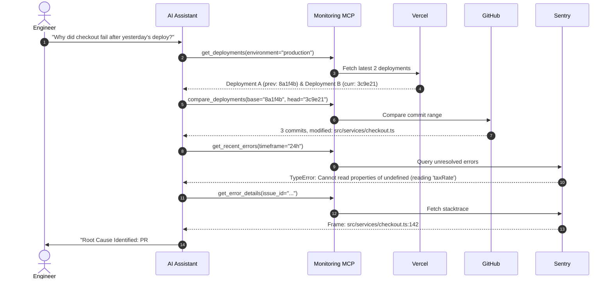

# 🛰️ Production Monitoring MCP

A production-grade Model Context Protocol (MCP) server that connects AI assistants directly to live observability stacks: **Sentry**, **GitHub**, **Vercel**, **Better Stack**, and **Cloudflare**.

Empowers AI agents to investigate production incidents, correlate code diffs with stack traces, diagnose latency anomalies, and triage regressions end-to-end.

---

## 🏗️ Architecture

```
AI Agent (Antigravity / Claude / Cursor)
   │
   ▼ [Model Context Protocol (JSON-RPC over stdio)]
┌────────────────────────────────────────────────────────┐
│             Production Monitoring MCP Server           │
│                                                        │
│  ┌──────────────────────────────────────────────────┐  │
│  │     Incident Correlation & Triage Engine         │  │
│  └──────────────────────┬───────────────────────────┘  │
│                         │                              │
│       ┌─────────┬───────┴───────┬─────────┐            │
│       ▼         ▼               ▼         ▼            │
│   [Sentry]  [GitHub]        [Vercel] [Better Stack]    │
│   (Errors & (Diffs &        (Deploys  (Uptime &        │
│    Traces)   Commits)        & Logs)   Logtail)        │
└───────┬─────────┬───────────────┬─────────┬────────────┘
        ▼         ▼               ▼         ▼
    Live Production APIs (Read-Only Authentication)
```

---

## 🛠️ Tools Exposed to AI Agents

| Tool Name | Provider | Description |
| :--- | :--- | :--- |
| `get_production_health` | **Pulse Engine** | Single-call operational pulse across uptime, Sentry error spikes, latest deployments, and 5xx rates. |
| `get_observability_status` | MCP Core | Verifies health of all integrations and surfaces missing keys. |
| `get_recent_errors` | Sentry | Lists recent production errors, frequency count, and affected users. |
| `get_error_details` | Sentry | Returns full stacktrace, code context, tags, and breadcrumbs. |
| `find_regression` | Sentry | Identifies regressed errors or issues introduced in a given release. |
| `get_recent_deployments` | Vercel / GitHub | Fetches recent production deployments, commit SHAs, and authors. |
| `get_deployments` | Vercel / GitHub | Alias for `get_recent_deployments`. |
| `get_deployment_logs` | Vercel | Fetches runtime and build logs for a specific deployment ID. |
| `compare_deployments` | GitHub | Compares two commit SHAs/tags: returns commit log and changed file diffs. |
| `get_commit_details` | GitHub | Retrieves author, commit message, stats, and patch snippets. |
| `check_uptime` | Better Stack | Checks availability, monitor statuses (`up`/`down`), and active incidents. |
| `analyze_logs` | Better Stack Logs | Queries structured application logs for error spikes and log anomalies. |
| `analyze_api_latency` | Cloudflare | Queries edge traffic, response distribution (2xx/4xx/5xx), and error rates. |
| `correlate_incident` | **Correlation Engine** | Cross-correlates deployment commits with Sentry stacktraces and telemetry for root cause analysis. |
| `explain_incident` | **Synthesis Engine** | Generates a human-readable executive briefing with suspected root cause, evidence chain, and recommendation. |

---

## 🚀 How the Incident Triage Flow Works

When an engineer asks:
> *"Why did checkout conversion drop after yesterday's deployment?"*

The agent executes the following multi-system triage chain:



---

## ⚙️ Quick Start (Interactive Setup Wizard)

### 1. Run the Setup Wizard
Run the interactive setup wizard via `npx` with zero local configuration required:

```bash
npx production-monitoring-mcp init
```

The terminal wizard will:
1. Let you choose the services you want to connect (Sentry, GitHub, Vercel, Better Stack, Cloudflare).
2. Prompt for your tokens and test each API connection live with real-time feedback.
3. Save your credentials securely in your machine's user configuration directory (`conf`).
4. **Automatically configure Claude Desktop and local AI clients** with zero manual editing.

---

### 2. Verify Connection Health
Run the built-in diagnostic doctor at any time:

```bash
npx production-monitoring-mcp doctor
```

---

## 🔌 Connecting to AI Clients

### Automatic Configuration
If you didn't run the installer during `init`, configure your local AI clients with:

```bash
npx production-monitoring-mcp install
```

### Manual Configuration
You can also add it manually to your client config:

#### Claude Desktop (`claude_desktop_config.json`)
```json
{
  "mcpServers": {
    "production-monitoring": {
      "command": "npx",
      "args": ["-y", "production-monitoring-mcp"]
    }
  }
}
```

#### Antigravity CLI / Gemini / Cursor (`mcp_servers.json`)
```json
{
  "mcpServers": {
    "production-monitoring": {
      "command": "npx",
      "args": ["-y", "production-monitoring-mcp"]
    }
  }
}
```

*(You can also pass environment variables directly in the `"env"` block if you prefer not to use the local config store)*

---

## 🛡️ Production Security
- **Read-Only Scopes**: Only read permissions (`project:read`, `event:read`, `repo:read`, `deployments:read`) are required.
- **Local Execution**: All requests are executed directly from your local machine over HTTPS with no third-party telemetry.
- **Graceful Degradation**: Unconfigured services return clear guidance without failing the entire server.
