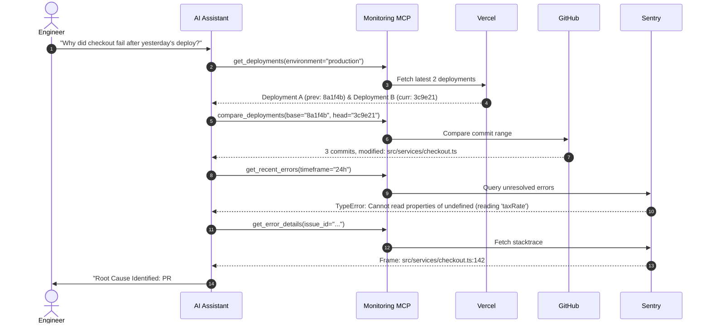

# 🛰️ Production Monitoring MCP

A production-grade Model Context Protocol (MCP) server that connects AI assistants directly to live observability stacks: **Sentry**, **GitHub**, **Vercel**, **Better Stack**, and **Cloudflare**.

Empowers AI agents to investigate production incidents, correlate code diffs with stack traces, diagnose latency anomalies, and triage regressions end-to-end.

---

## 🏗️ Architecture

```
AI Agent (Antigravity / Claude / Cursor)
   │
   ▼ [Model Context Protocol (JSON-RPC over stdio)]
┌────────────────────────────────────────────────────────┐
│             Production Monitoring MCP Server           │
│                                                        │
│  ┌──────────────────────────────────────────────────┐  │
│  │     Incident Correlation & Triage Engine         │  │
│  └──────────────────────┬───────────────────────────┘  │
│                         │                              │
│       ┌─────────┬───────┴───────┬─────────┐            │
│       ▼         ▼               ▼         ▼            │
│   [Sentry]  [GitHub]        [Vercel] [Better Stack]    │
│   (Errors & (Diffs &        (Deploys  (Uptime &        │
│    Traces)   Commits)        & Logs)   Logtail)        │
└───────┬─────────┬───────────────┬─────────┬────────────┘
        ▼         ▼               ▼         ▼
    Live Production APIs (Read-Only Authentication)
```

---

## 🛠️ Tools Exposed to AI Agents

| Tool Name | Provider | Description |
| :--- | :--- | :--- |
| `get_observability_status` | MCP Core | Verifies health of all integrations and surfaces missing keys. |
| `get_recent_errors` | Sentry | Lists recent production errors, frequency count, and affected users. |
| `get_error_details` | Sentry | Returns full stacktrace, code context, tags, and breadcrumbs. |
| `find_regression` | Sentry | Identifies regressed errors or issues introduced in a given release. |
| `get_deployments` | Vercel / GitHub | Fetches recent production/preview deployments and git commits. |
| `get_deployment_logs` | Vercel | Fetches runtime and build logs for a specific deployment ID. |
| `compare_deployments` | GitHub | Compares two commit SHAs/tags: returns commit log and changed file diffs. |
| `get_commit_details` | GitHub | Retrieves author, commit message, stats, and patch snippets. |
| `check_uptime` | Better Stack | Checks availability, monitor statuses (`up`/`down`), and active incidents. |
| `analyze_logs` | Better Stack Logs | Queries structured application logs for error spikes and log anomalies. |
| `analyze_api_latency` | Cloudflare | Queries edge traffic, response distribution (2xx/4xx/5xx), and error rates. |
| `correlate_incident` | **Correlation Engine** | Cross-correlates deployment commits with Sentry stacktraces for root cause analysis. |

---

## 🚀 How the Incident Triage Flow Works

When an engineer asks:
> *"Why did checkout conversion drop after yesterday's deployment?"*

The agent executes the following multi-system triage chain:



---

## ⚙️ Quick Start

### 1. Prerequisites
- **Node.js**: v20 or higher
- **npm** or **pnpm**

### 2. Setup & Environment Variables
Copy `.env.example` to `.env`:

```bash
cp .env.example .env
```

Configure the tokens for your stack:
```ini
# Sentry
SENTRY_AUTH_TOKEN=sntrys_...
SENTRY_ORG=your-sentry-org
SENTRY_PROJECT=your-project

# GitHub
GITHUB_TOKEN=ghp_...
GITHUB_OWNER=your-org
GITHUB_REPO=your-repo

# Vercel
VERCEL_TOKEN=...
VERCEL_PROJECT_ID=...

# Better Stack
BETTERSTACK_API_TOKEN=...
BETTERSTACK_LOGS_TOKEN=...

# Cloudflare (Optional)
CLOUDFLARE_API_TOKEN=...
CLOUDFLARE_ZONE_ID=...
```

### 3. Verify Connectivity
Run the built-in diagnostic checker:
```bash
npm run check
```

Expected output:
```text
=================================================
 🛰️  Production Monitoring MCP - Health Check
=================================================

✅ Sentry: CONNECTED (Org: acme-corp | 3 recent errors)
✅ GitHub: CONNECTED (Repo: acme-corp/api)
✅ Vercel: CONNECTED (Found 5 deployments)
✅ Better Stack: CONNECTED (All monitors UP)
⚪ Cloudflare: SKIPPED (No token configured)
```

### 4. Build
```bash
npm run build
```

---

## 🔌 Connecting to AI Clients

### Antigravity CLI / Gemini Code Assist
Add to your `mcp_servers.json`:
```json
{
  "mcpServers": {
    "production-monitoring": {
      "command": "node",
      "args": ["/absolute/path/to/production-monitoring-mcp/dist/index.js"],
      "env": {
        "SENTRY_AUTH_TOKEN": "your-sentry-token",
        "SENTRY_ORG": "your-org",
        "GITHUB_TOKEN": "your-github-token",
        "GITHUB_OWNER": "your-owner",
        "GITHUB_REPO": "your-repo",
        "VERCEL_TOKEN": "your-vercel-token",
        "BETTERSTACK_API_TOKEN": "your-betterstack-token"
      }
    }
  }
}
```

### Claude Desktop (`claude_desktop_config.json`)
```json
{
  "mcpServers": {
    "prod-monitoring": {
      "command": "node",
      "args": ["/absolute/path/to/production-monitoring-mcp/dist/index.js"]
    }
  }
}
```

---

## 🛡️ Production Security
- **Read-Only Scopes**: Only read permissions (`project:read`, `event:read`, `repo:read`, `deployments:read`) are required.
- **Local Execution**: All requests are executed directly from your local machine over HTTPS with no third-party telemetry.
- **Graceful Degradation**: Unconfigured services return clear guidance without failing the entire server.
